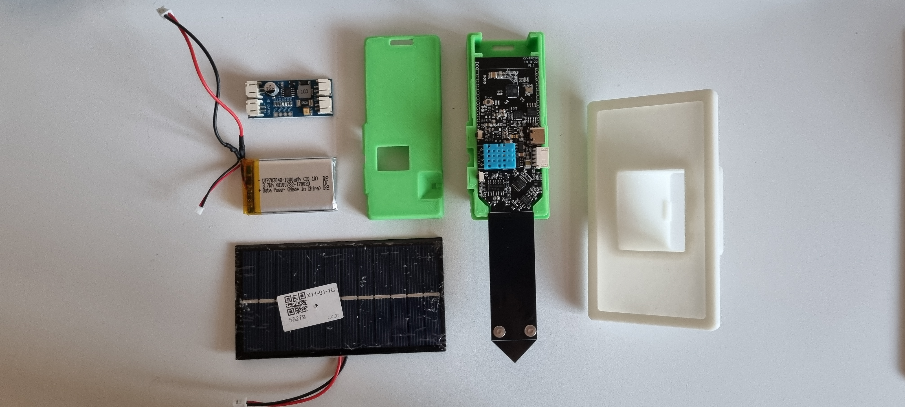
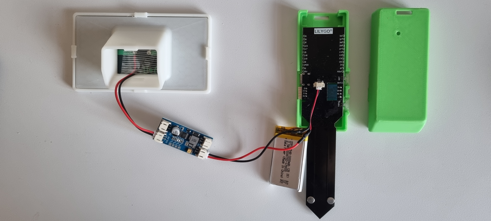

# FuzzyPotato
The solar-powered an IoT-based system for monitoring environmental conditions using various sensors and transmitting the data to a server with the ESP32 micro-controller unit. (Temperature, Humidity, Illuminance (Lux), Soil Moisture, Soil Salinity, Battery Voltage) The system is designed to operate on an ESP32 microcontroller, utilizing Wi-Fi for connectivity and deep sleep mode for power conservation.
  

## What's New

Click to Expand

  
### v1.0
#### April 30, 2021
> [Initial Release](https://github.com/happybono/FuzzyPotato/commit/69261c0585d91c82cd700f809ad399d5e69eef05)
  
#### December 6, 2021
> [Now supports E-mail notifications.](https://github.com/happybono/FuzzyPotato/blob/main/MATLAB%20Analysis/Email%20Notifications.m)
  
#### February 4, 2022
> [Added comments within the source code.](https://github.com/happybono/FuzzyPotato/blob/main/FuzzyPotato/FuzzyPotato.ino)
  
#### March 4, 2022
> [Uploaded required libraries.](https://github.com/happybono/FuzzyPotato/tree/main/Libraries)

#### June 27, 2022
> [Improvements in the remaining battery calculation algorithm.](https://github.com/happybono/FuzzyPotato/blob/main/Plugins/StatusUpdates/JavaScript.js)

#### January 31, 2026
> [Applied text flipping animation to the "Latest Smart-flowerpot Sensor Readings" plugin.](https://github.com/happybono/FuzzyPotato/blob/main/Plugins/StatusUpdates/JavaScript.js)

### Features
- **Real-time Sensor Data Collection :** Measures temperature, humidity, soil moisture, soil salinity, light intensity, and battery voltage.
- **Data Transmission :** Sends sensor data to the ThingSpeak server for remote monitoring and analysis.
- **Power Management :** Utilizes deep sleep mode to conserve power and extend battery life.
- **Watchdog Timer :** Ensures system stability and automatic recovery in case of failures.

### Sensors and Components
- **DHT12 Sensor :** Measures temperature and humidity.
- **BH1750 Sensor :** Measures light intensity.
- **Analog Pins :** Measures soil moisture, soil salinity, and battery voltage.
- **Power Control Pin :** Manages the power to the sensors to conserve energy.

### Technologies Used
- **Language:** C++
- **Platform:** Arduino / ESP32

### Code Structure
- **WiFi Setup :** Connects to the specified Wi-Fi network using provided SSID and password.
- **Sensor Initialization :** Initializes the I2C bus and sensors.
- **Data Collection Functions :** Reads data from each sensor and calculates average values.
- **HTTP POST Request :** Sends collected sensor data to the ThingSpeak server.
- **Deep Sleep Function :** Puts the ESP32 into deep sleep mode to save power between data collection cycles.

#### Functions and Methods
- **`setup()`** : Initializes serial communication, Wi-Fi connection, sensors, and watchdog timer.
- **`loop()`** : Collects sensor data, sends it to the server, and enters deep sleep mode.
- **`sleepGo()`** : Configures and enters deep sleep mode for a specified duration.
- **`readTemp()`** : Reads and averages temperature data from the DHT12 sensor.
- **`readHumi()`** : Reads and averages humidity data from the DHT12 sensor.
- **`readSalt()`** : Reads and averages soil salinity data.
- **`readSoil()`** : Reads and averages soil moisture data.
- **`readLux()`** : Reads and averages light intensity data from the BH1750 sensor.
- **`readBattery()`** : Reads and averages battery voltage data.

#### Example Output
Temperature = 23.45  
Humidity    = 56.78  
soil = 12.34  
salt = 1.23  
lux = 456.78  
bat = 3.70  
HTTP Response code : 200  

## Hardware Specifications
### Connections
* 1 x USB-C

### Wireless
* IEEE 802.11 b/g/n Wi-Fi technology.
* Bluetooth: v4.2 BR/EDR and BLE (shares the radio with Wi-Fi)

## Sensors and Components

**DHT12 Sensor :** Measures temperature and humidity.  
**BH1750 Sensor :** Measures light intensity.  
**Analog Pins :** Measures soil moisture, soil salinity, and battery voltage.  
**Power Control Pin :** Manages the power to the sensors to conserve energy.  

### Platform
* ESP-32 Dev-Board

### Capacitive Soil Moisture Sensor with the dedicated Soil Salinity Sensor 

### DHT-11 Temperature / Humidity Sensor

### Illuminance Sensor

### Li-Polymer Battery
* 3.7 V
* 1200 mAh

### MTTP charging module
- 6.0 V

### Solar Panel & Battery
- 6.0 V
- 1A

### USB-C Type Cable

## License
This project is licensed under the MIT License. See the `LICENSE` file for details.

## Copyright 
Copyright ⓒ HappyBono 2021 - 2026. All rights Reserved.
